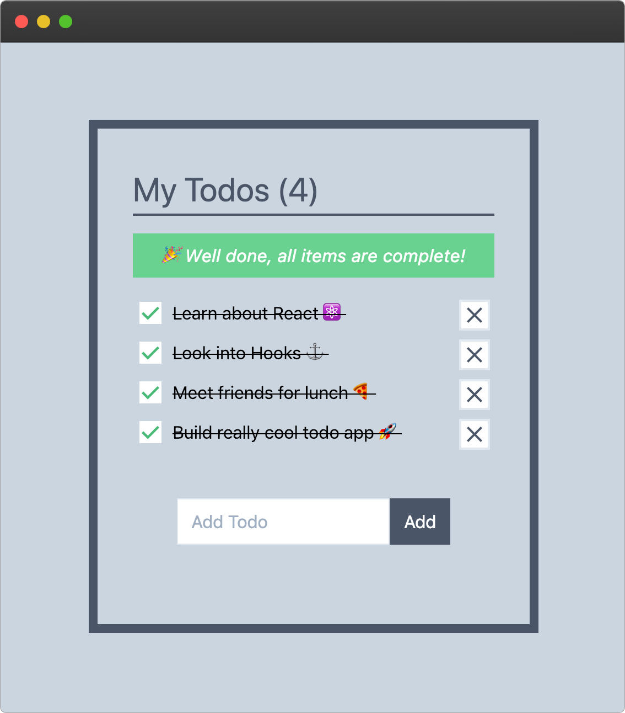

# Todo App ⚛️⚓️🚀

 
    

---

Simple Todo App built using React and new React Hooks API.

# Contains
- [CRA](https://github.com/facebook/create-react-app) Starter
- Tailwind
- PurgeCss
- PostCss

*This starter has been customised from the default CRA starter to also contain required setup to get CRA working alongside TailwindCss with PurgeCss configured via PostCss. Project template that was used to generate this can be found [here](https://github.com/rahman95/cra-tailwind-purgecss-starter)*